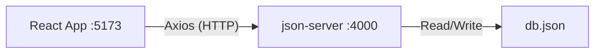
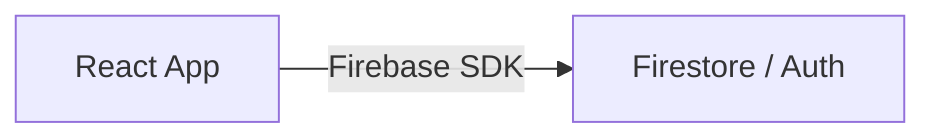
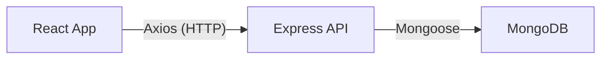

# TaskFlow Architecture & Reflection (TP4)

## 🧩 Part 4: Database Architecture

### 1. Current Architecture (json-server)

**HTTP Methods used:**
- `GET`: Fetch projects and columns.
- `POST`: Create a new project.
- `PUT`: Update/Rename an existing project.
- `DELETE`: Remove a project.

---

### 2. Alternative Architectures

#### a) Firebase (Serverless)

- **Pros:** No backend to manage, real-time updates out of the box, easy authentication.
- **Cons:** Vendor lock-in, pricing can scale quickly.

#### b) Custom Backend (Express + MongoDB)

- **Pros:** Full control over logic and data, industry standard (MERN stack).
- **Cons:** More code to maintain (routing, controllers, models, security).

---

## 🧩 Part 5: Reflection Answers

### 1. Why React cannot connect directly to MySQL?
React is a client-side library that runs in the browser. Database credentials (host, user, password) would be exposed in the frontend code, which is a major security risk. Additionally, browsers do not have the necessary drivers to communicate directly with SQL databases over standard protocols. A backend API (Node.js, PHP, etc.) is needed to act as a secure intermediary.

### 2. 3 limitations of json-server (not for production)
- **Security:** No built-in authentication or fine-grained authorization.
- **Performance:** It's not optimized for high concurrent traffic or large datasets.
- **Data Integrity:** It doesn't support complex relationships or ACID transactions like a real RDBMS.

### 3. Why Firebase allows direct connection?
Firebase provides a specialized Client SDK that handles security via **Security Rules** defined on the server-side. It communicates over secure WebSockets or HTTPS and abstracts the backend logic, allowing developers to query data safely from the frontend without exposing administrative credentials.

### 4. MUI vs Bootstrap: which is better and why?
- **MUI** is better for complex, professional-looking dashboards that require a consistent "Material Design" feel. It offers powerful components (DataGrid, DatePickers) and a robust theme system (`sx` prop).
- **Bootstrap** is better for rapid prototyping and simpler responsive websites. It is more lightweight and easier to learn if you already know standard CSS classes.

### 5. Risks of using external UI libraries?
- **Bundle Size:** They can significantly increase the total size of your JavaScript files.
- **Dependency:** If the library is no longer maintained, your project might stop receiving security updates or bug fixes.
- **Customization:** It can be difficult to deviate from the library's pre-defined design patterns (the "MUI look").

### 6. Best choice for real-time chat?
**Firebase** (or a custom backend with **Socket.io**) is the best choice. json-server doesn't support real-time events (WebSockets). Firebase's "Realtime Database" or "Firestore" automatically pushes updates to clients as soon as they happen, making it ideal for chat applications.
